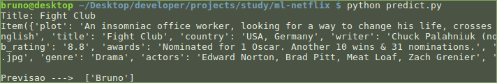

ml-netflix
---

**Atenção:** não leve esse repositório a sério. Conforme comentado [aqui][1] (ainda estrou escrevendo o texto!), são os 
meus primeiros passos com essa coisa chamada Machine Learning. Espero que seja útil a quem também está começando pois há
as "receitas" iniciais, que quebrei bastante a cabeça para fazer funcionar.

Esse mini-projeto tem como objetivo colocar em prática os conteúdos que tenho estudado sobre **Machine Learning**.

A ideia é: 

> "Com base no nome de um filme/série, é possível descobrir quem está o assistindo?"

O estudo é feito a partir de informações (obtidas no IMDB) do filme/série.

## Os passos que dei

1. Peguei todo o meu histórico no [site da Netflix][2]. Tinha cerca de 2.000 registros de uns 3 anos atrás.
2. Coloquei todo o histórico em uma planilha Excel, fiz algumas limpezas, removi os duplicados.
3. Fiquei sabendo do [OMDB][3]. Fiz um script para percorrer cada histórico que tinha no Excel e consultar as informações no OMDB.
4. Com toda a base montada, comecei a rotular cada registro do histórico com as seguintes opções: `Ana`, `Bruno`, `Dois`.
5. Muitos registros eu não lembrava apenas pelo nome, então fiz um script para criar um html com todos as imagens dos 
poster dos filmes/séries. Ajustei alguns rótulos. Deu trabalho.
6. Comecei a preparar o treino do Classifier. Comecei utilizando apenas a feature `year`.
7. Percebi que seria difícil fazer funcionar pois grande parte do histórico (95%) é da minha esposa.
8. Comecei a adicionar mais features para ver como seria o comportamento. Continuou não parecendo bom.
9. Então comecei a adicionar mais features só para adicionar complexidade a essa minha prática.
10. Algumas features (por exemplo, `genre` e `actors`) parecem precisar de um trabalho de texto. Fui pesquisar como fazer
isso. Já tinha lido sobre isso, mas nunca sobre juntar uma feature texto com uma numérica. Passei horas nisso. Alguns
links me ajudaram: [esse][4], [esse][5], e [esse também][6].
11. Depois de muito sofrer com tudo isso, fiz um refactor nos arquivos. Deixei mais simples.
12. Depois criei arquivos fazendo pequenas tarefas (`add_movie_info.py`, `train.py`, `predict.py`).
13. Decidi apagar todo o banco de dados que montei nos primeiros passos e que tomaram bastante tempo. Decidi que vou ir
adicionando aos poucos alguns registros através do `add_movie_info.py` e ver se a "accuracy" aumenta com o passar do 
tempo. (e tenho que assistir mais Netflix para ter mais registros! hehehe)
14. Desabilitei várias features e deixei apenas a `gender`. Depois vou adicionado as outras aos poucos (mas elas estão
lá, comentadas).
15. Publiquei o código no GitHub. Às 23h de um domingo que passou e eu nem vi. Mas isso foi legal de se fazer :).

## Próximos passos

* Adicionar aos poucos mais registros.
* Ir melhorando aos poucos a medida que vou adquirindo mais conhecimentos nos cursos e livros que estou acompanhando.
* Torcer para alguém comentar, dar dica, ensinar algo aqui.
* Chegar à conclusão se é possível ou não fazer alguma previsão com base nos dados disponíveis.

## Informações

O banco de dados está em `data/data.csv`. A primeira linha tem o cabeçalho do CSV. Deixei alguns registros para você
ter ideia do formato das informações.

Execute `python add_movie_info.py` para adicionar um registro.

Execute `python train.py` para treinar o classifier.

Execute `python predict.py` para tentar prever algo. Será algo assim: 

Ainda vou criar um `requirements.txt`, mas acredito que com os seguintes módulos você já deve conseguir executar tudo:

* scipy
* sklearn
* omdb
* pickle

[1]: #texto-em-producao
[2]: https://www.netflix.com/viewingactivity
[3]: https://www.omdbapi.com/
[4]: http://blog.kaggle.com/2016/07/21/approaching-almost-any-machine-learning-problem-abhishek-thakur/
[5]: http://stackoverflow.com/questions/30653642/combining-bag-of-words-and-other-features-in-one-model-using-sklearn-and-pandas
[6]: https://docs.scipy.org/doc/scipy/reference/generated/scipy.sparse.hstack.html